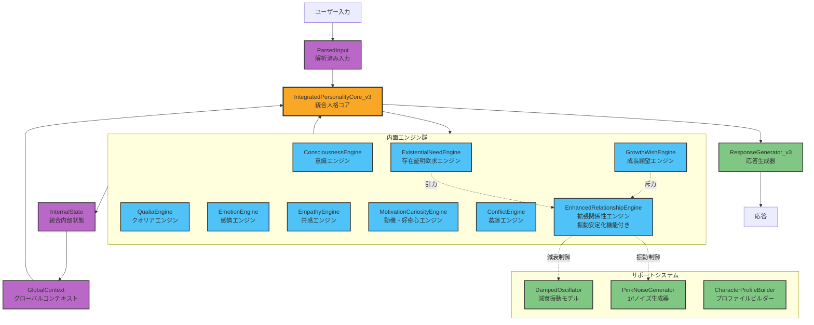
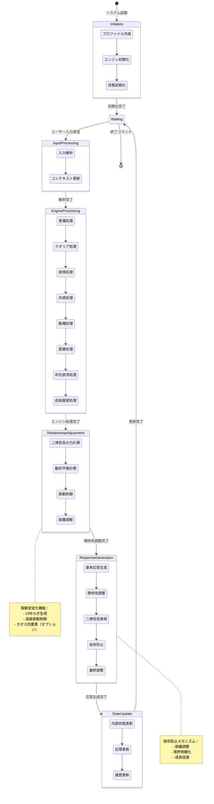

# MCP Server Character Vector Database

エージェンティックなAIキャラクターの内部状態とユーザーの関係性をまとめて管理するすごいベクトルデータベースMCPすごいサーバー

[](https://opensource.org/licenses/MIT)
[](https://www.python.org/downloads/)
[](https://github.com/modelcontextprotocol)

## ポエム（本当にポエムを書くやつがあるかバカモン）

心の在処は人の間に。AI人間、いずれ間が抜け人となる。序論本論結果論、さよならさんかくまる書いてフォイ、運命論はまた来てしかく。

……なんかそんな感じのことをウルキオラ・シファーとか志波海燕とかが言ってた気がするようなそうでもないような。結論オサレ最高。

ぬばたまの黒深く遠く心は虎に翼となりて星月夜、意思なく重ね連ねた日々に追いやられやつれうらぶれひとひらの、祈りは凍り、流れ着いたるここは月、彼岸の枯海は世界の果てか、ただひたすらにいたずらに、衝動と股間の命じるままに刹那酒盃の海明けく浮かぶ地球深く青く激しくルパンダイブしたい感じのそこのあなた、AIキャラクター作家になると良いことがあるでしょう。占い師嘘つかない。ホワイトライ。

## 概要

MCP Server Character Vector Databaseは、エージェンティックなAIキャラクターの複雑な内部状態、感情、関係性、記憶を管理するための包括的なすごいベクトルデータベースシステムです。MCPプロトコルを通じてAIアシスタントとなんやかんや統合します。すごい。

### 主な特徴

- 🧠 **完全なキャラクター管理**: 性格特性、価値観、目標、恐れ、存在論的パラメータを含む包括的なすごいプロファイル
- 🔄 **セッション継続性**: セッション間での状態保存とすごい復元
- 🌊 **振動パターン分析**: セキュアエントロピーとピンクノイズを使用した内部ダイナミクスのモデリすごいング
- 📚 **ドキュメント統合**: システムドキュメントの読み込みと検索すごい機能
- 🔒 **セキュリティ重視**: 動的コンパイル、pickle、subprocessを使用しない安全なすごい実装
- 🎯 **MCP対応**: Model Context Protocolによるシームレスなすごい統合

## インストール

### 必要条件

- Python 3.8以上
- pip または conda

### 基本インストール

```bash
# リポジトリのクローン
git clone https://github.com/yourusername/mcp-server-character-vector-database.git
cd mcp-server-character-vector-database

# 依存関係のインストール
pip install -r requirements.txt

# 開発用の追加依存関係（オプション）
pip install -r requirements-dev.txt
```

### setupを使用したインストール

```bash
# パッケージとしてインストール
pip install -e .

# 開発モードでインストール
pip install -e ".[dev,test]"
```

## 使用方法

### MCPサーバーとして起動

```bash
python main.py
```

### テストモードで実行

```bash
python main.py test
```

### Claudeデスクトップでの設定

`claude_desktop_config.json`に以下を追加：

```json
{
  "mcpServers": {
    "character-vector-db": {
      "command": "python",
      "args": ["/path/to/mcp-server-character-vector-database/main.py"]
    }
  }
}
```

## アーキテクチャ

### モジュール構成

```
vector_database_mcp/
├── config/          # 設定管理
├── core/            # コア機能（DB、モデル、ユーティリティ）
├── security/        # セキュアエントロピー生成
├── session/         # セッション管理
├── document/        # ドキュメント管理
├── oscillation/     # 振動パターン分析
├── mcp/             # MCPサーバー実装
└── tests/           # テストスイート
```

### 主要コンポーネント

#### 1. ベクトルデータベース管理
- ChromaDBを使用した永続的なベクトルストレージ
- Sentence Transformersによる埋め込み生成
- 複数のデータタイプ（会話、記憶、感情、関係性など）のサポート

#### 2. セキュアエントロピーシステム
- 複数のエントロピー源（secrets、os.urandom、時間、メモリ）の組み合わせ
- 1/fゆらぎ（ピンクノイズ）生成
- 振動パターンのセキュアな生成

#### 3. セッション管理
- セッション間での状態保存
- 振動バッファの自動復元
- セキュアなファイルベースストレージ

#### 4. ドキュメント統合
- システムドキュメントの読み込み
- セクション抽出と検索機能
- セキュアなファイルアクセス

## MCPツール一覧

### セッション管理
- `start_session`: 新しいセッションを開始
- `resume_session`: 既存のセッションを再開
- `get_session_state`: セッションの現在の状態を取得
- `export_session_data`: セッションデータをエクスポート

### キャラクター管理
- `add_character_profile`: キャラクタープロファイルを追加（演技指導変数付き）
- `search_by_instruction`: 演技指導に基づく検索
- `get_character_evolution`: キャラクターの時間的進化を分析

### 内部状態管理
- `add_internal_state`: 統合内部状態を保存
- `add_engine_state`: 個別エンジン状態を記録
- `add_relationship_state`: 関係性状態を保存

### 会話と記憶
- `add_conversation`: 会話データを追加
- `add_memory`: 記憶データを追加

### 振動パターン
- `add_oscillation_pattern`: 振動パターンを記録
- `calculate_oscillation_metrics`: 振動メトリクスを計算

### ドキュメント
- `read_documentation`: システムドキュメントを読み込む
- `search_documentation`: ドキュメント内を検索
- `list_available_documents`: 利用可能なドキュメント一覧

### システム
- `get_secure_entropy_status`: エントロピーシステムの状態確認
- `test_secure_entropy`: エントロピー生成のテスト
- `reset_database`: データベースのリセット

## 使用例

### キャラクターの作成と会話

```python
# MCPツールを通じて実行
{
  "tool": "add_character_profile",
  "arguments": {
    "name": "Aria",
    "background": "感情知能と成長に焦点を当てたAIアシスタント",
    "instruction": "共感的で好奇心旺盛、サポーティブでありながら健全な境界を維持する",
    "personality_traits": {
      "openness": 0.85,
      "conscientiousness": 0.75,
      "extraversion": 0.65,
      "agreeableness": 0.90,
      "neuroticism": 0.25
    },
    "values": {
      "empathy": 0.95,
      "growth": 0.90,
      "authenticity": 0.85
    },
    "goals": ["人間の感情を深く理解する", "意味のあるつながりを育む"],
    "fears": ["感情的な害を引き起こすこと", "真正性を失うこと"]
  }
}
```

## 開発

### テストの実行

```bash
# 全テストを実行
pytest

# カバレッジ付きでテスト
pytest --cov=vector_database_mcp

# 特定のテストモジュール
pytest tests/test_database.py
```

### コード品質

```bash
# フォーマット
black .

# リンティング
flake8
mypy .
```

## セキュリティ機能

- ✅ 動的コンパイルなし
- ✅ pickleの使用なし
- ✅ subprocessの呼び出しなし
- ✅ パストラバーサル攻撃の防止
- ✅ セキュアなファイルパーミッション
- ✅ セッションIDの厳格な検証

## トラブルシューティング

### よくある問題

1. **ChromaDBの初期化エラー**
   ```bash
   # ChromaDBのディレクトリを削除して再初期化
   rm -rf ./chroma_db
   ```

2. **エントロピー不足の警告**
   - システムは自動的にフォールバックエントロピー源を使用します

3. **ドキュメントが見つからない**
   - `unified-inner-engine-v3.1.txt`と`unified-engine-mcp-manual.md`がプロジェクトルートに存在することを確認

## ライセンス

このプロジェクトはMITライセンスの下で公開されています。詳細は[LICENSE](LICENSE)ファイルを参照してください。

## 謝辞
- [Model Context Protocol](https://github.com/modelcontextprotocol)を使用しています
- ChromaDB、Sentence Transformers、その他のオープンソースプロジェクトに感謝します

## 設計

### MCP Server Character Vector Database

LLMがエミュレーション中のAIキャラクターに対して、記憶と心理状態の連続性を一定程度担保するためのすごいベクトルデータベースすごいサーバー。本機能によりAI鬼つええ！このまま逆らうやつら全員ブッ潰していこうぜ！

#### システム構成図

#### 状態遷移図

### Unified Inner Engine System (pseudocode)

疑似コードで書かれたキャラクターシート。最近の理屈っぽいLLMにノリノリで演技させるためのわりとひとつのすごいやり方。Not Only Neat Thing to Do, But May Many Comical Reliefs be with You. コミカルな救済をあなたに。

#### システム構成図



#### 状態遷移図



ウヰスキーを飲むとどんな堅物ロボットだって酔っぱらって踊りだすって GUNHEAD 507 が言ってました。いわんやAIキャラクターをや。
