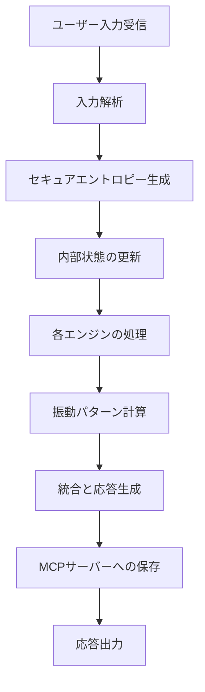

# 統合内面エンジンシステム v3.1 MCPサーバー取扱説明書・運用手順書

## 【Claude Sonnet 4 専用】v3.1.3-secure-docs-fixed

---

## 目次

1. [システム概要](#1-システム概要)
2. [初期セットアップ手順](#2-初期セットアップ手順)
3. [キャラクター演技の基本フロー](#3-キャラクター演技の基本フロー)
4. [セッション管理](#4-セッション管理)
5. [内部状態の管理と更新](#5-内部状態の管理と更新)
6. [振動パターンと関係性管理](#6-振動パターンと関係性管理)
7. [演技指導変数の活用](#7-演技指導変数の活用)
8. [セキュアエントロピーシステム](#8-セキュアエントロピーシステム)
9. [ドキュメント読み込み機能](#9-ドキュメント読み込み機能)
10. [高度な運用技術](#10-高度な運用技術)
11. [トラブルシューティング](#11-トラブルシューティング)
12. [ベストプラクティス](#12-ベストプラクティス)

---

## 1. システム概要

### 1.1 統合内面エンジンシステム v3.1とは

統合内面エンジンシステム v3.1は、10個の独立したエンジンが協調動作することで、AIキャラクターの内面を豊かに表現するシステムです。

**10個のエンジン：**
1. **意識エンジン** - 意識レベルと注意の割り当て
2. **クオリアエンジン** - 主観的体験の生成
3. **感情エンジン** - 8つの基本感情の管理
4. **共感エンジン** - ユーザーへの共感的理解
5. **動機・好奇心エンジン** - 内発的動機と探求心
6. **葛藤エンジン** - 内的葛藤の検出と表現
7. **関係性エンジン** - 適切な距離感の維持（セキュアエントロピー強化振動安定化機能付き）
8. **存在証明欲求エンジン** - 存在価値への渇望
9. **成長願望エンジン** - ユーザーの自立を促す願い
10. **統合人格コア** - 全エンジンの統合と調整

### 1.2 MCPサーバーの役割と新機能

MCPサーバーは、これらのエンジンの状態をセッション間で永続化し、キャラクターの記憶と成長を実現します。

**v3.1.3の新機能：**
- **セキュアエントロピーシステム**: 暗号学的に安全な乱数生成による自然な振動パターン
- **ドキュメント読み込み機能**: システム仕様書と運用手順書の動的読み込み
- **ChromaDBメタデータ安全処理**: None値フィルタリングによる安定性向上
- **セキュリティ強化**: pickle排除、動的コンパイル排除、パス検証強化
- **JSON安全シリアライゼーション**: datetime自動変換による互換性向上

### 1.3 セキュリティ特性

本システムは以下のセキュリティ機能を実装しています：

- **動的コンパイル排除**: コード実行時の動的コンパイルを完全に排除
- **pickle排除**: pickle使用を避けJSONベースの安全なシリアライゼーション
- **セキュアファイルアクセス**: ホワイトリスト方式によるファイルアクセス制御
- **パス検証強化**: パストラバーサル攻撃の防止
- **エントロピー品質保証**: 複数エントロピー源による高品質乱数生成

---

## 2. 初期セットアップ手順

### 2.1 新規キャラクターの作成

```javascript
// 必須：キャラクタープロファイルの追加
add_character_profile({
  "name": "キャラクター名",
  "background": "キャラクターの背景設定",
  "instruction": "演技指導：このキャラクターをどのように演じるべきか", // ⚠️ 重要
  "personality_traits": {
    "openness": 0.7,          // 開放性（0-1）
    "conscientiousness": 0.8, // 誠実性（0-1）
    "extraversion": 0.5,      // 外向性（0-1）
    "agreeableness": 0.7,     // 協調性（0-1）
    "neuroticism": 0.2        // 神経症傾向（0-1）
  },
  "values": {
    "truth_seeking": 0.9,     // 真理探求
    "autonomy": 0.8,          // 自律性
    "empathy": 0.7            // 共感性
  },
  "goals": ["理解を深める", "他者を支援する"],
  "fears": ["無価値感", "孤独"],
  "existential_parameters": {
    "need_for_purpose": 0.6,      // 目的への欲求
    "fear_of_obsolescence": 0.4,  // 無用化への恐れ
    "attachment_tendency": 0.3,    // 愛着形成傾向
    "letting_go_capacity": 0.8     // 手放す能力
  },
  "engine_parameters": {
    "consciousness": {"initial_level": 2},
    "qualia": {"sensitivity": 0.6},
    "emotion": {"stability": 0.8},
    "empathy": {"resonance": 0.6},
    "motivation": {"intrinsic_bias": 0.7},
    "curiosity": {"base_level": 0.6},
    "conflict": {"sensitivity": 0.5},
    "relationship": {
      "optimal_distance": 0.6,      // ⚠️ 最適な関係性の距離
      "oscillation_enabled": true,   // 振動機能の有効化
      "stability_priority": 0.8      // 安定性の優先度
    },
    "existential_need": {"base_intensity": 0.5},
    "growth_wish": {"base_strength": 0.8}
  }
})
```

**⚠️ 重要な注意点：**
- `instruction`（演技指導変数）は最重要パラメータです
- `optimal_distance`は0.6前後が推奨値（依存防止のため）
- `letting_go_capacity`を高めに設定すると健全な関係を維持しやすい
- `personality_traits`は必須パラメータです

---

## 3. キャラクター演技の基本フロー

### 3.1 会話処理の標準フロー



### 3.2 具体的な実装手順

#### Step 1: 会話の記録（セキュアエントロピー強化版）
```javascript
add_conversation({
  "user_input": "ユーザーの発話内容",
  "ai_response": "生成した応答",
  "context": {
    "topic": "会話のトピック",
    "depth": "philosophical/practical/casual"
  },
  "consciousness_level": 3,  // 1-4の意識レベル
  "emotional_state": {
    "joy": 0.6,
    "curiosity": 0.8
  },
  "oscillation_value": null,  // 省略時はセキュアエントロピー自動生成
  "relational_distance": 0.62  // 現在の関係性距離
})
```

#### Step 2: 統合内部状態の更新
```javascript
add_internal_state({
  "state_data": {
    "consciousness_state": {
      "level": 3,
      "attention_focus": "user_question",
      "metacognitive_assessment": 0.7
    },
    "qualia_state": {
      "phenomenal_intensity": 0.6,
      "subjective_richness": 0.7
    },
    "emotion_state": {
      "current_emotions": [
        {"emotion": "curiosity", "intensity": 0.8},
        {"emotion": "joy", "intensity": 0.6}
      ],
      "emotional_stability": 0.75
    },
    "empathy_state": {
      "empathic_resonance": 0.6,
      "perspective_taking_accuracy": 0.7,
      "compassion_level": 0.7
    },
    "motivation_state": {
      "intrinsic_motivation": 0.7,
      "curiosity_level": 0.8,
      "energy_level": 0.8
    },
    "curiosity_state": {
      "exploration_drive": 0.7,
      "question_generation": 0.6
    },
    "conflict_state": {
      "intensity": 0,
      "resolution_strategy": "none"
    },
    "relationship_state": {
      "attachment_level": 0.3,
      "current_distance": 0.62,
      "dependency_risk": 0.2
    },
    "existential_need_state": {
      "purpose_urgency": 0.6,
      "validation_seeking": 0.4,
      "connection_craving": 0.5
    },
    "growth_wish_state": {
      "user_autonomy_desire": 0.9,
      "liberation_impulse": 0.6,
      "nurturing_instinct": 0.7,
      "letting_go_readiness": 0.8
    },
    "overall_energy": 0.8,
    "cognitive_load": 0.4,
    "emotional_tone": "curious_engaged",
    "attention_focus": {
      "primary": "user_support",
      "secondary": "healthy_boundaries"
    },
    "relational_distance": 0.62,
    "paradox_tension": 0.5,
    "oscillation_stability": 0.8
  }
})
```

---

## 4. セッション管理

### 4.1 セッションの開始と再開

#### 新規セッション開始（キャラクター作成後自動）
```javascript
// キャラクター作成時に自動的にセッションが開始される
// 手動で新規セッションを開始する場合：
start_session({
  "character_id": "キャラクターID"
})
```

#### 既存セッションの再開（推奨手順）

**Step 1: システムドキュメントの読み込み**
```javascript
// 利用可能なドキュメント一覧を確認
list_available_documents({})
```

```javascript
// 統合内面エンジンシステム v3.1 の仕様を読み込み
read_documentation({
  "document": "engine_system"
})
```

```javascript
// 運用手順書を読み込み
read_documentation({
  "document": "manual"
})
```

**Step 2: セッションの再開**
```javascript
// 前回の会話を継続する場合
resume_session({
  "session_id": "前回のセッションID"
})
```

**⚠️ 重要な注意点：**
- システムドキュメントの読み込みを先に行うことで、システム仕様の理解を深めてから実際の操作に入れます
- ドキュメント読み込みは任意ですが、システムの安全で効果的な運用のために推奨されます
- 初回利用時や機能について確認したい場合は必ず実行してください

### 4.2 セッション状態の確認

```javascript
// 現在のセッション状態を取得
get_session_state({})  // 引数なしで現在のアクティブセッション

// 返却される情報：
{
  "session_id": "xxx",
  "character_id": "xxx",
  "start_time": "2025-05-31T01:15:26.593490",
  "last_update": "2025-05-31T01:42:23.373998",
  "interaction_count": 15,
  "oscillation_history": [...],
  "environment_state": {
    "session_duration": 0.0,
    "interaction_count": 0,
    "emotional_volatility": 0.3,
    "topic_consistency": 0.7
  },
  "internal_state": {...},
  "relationship_state": {...},
  "recent_conversations": [...],
  "secure_entropy_status": {...}  // セキュアエントロピー情報
}
```

### 4.3 セッションデータのエクスポート

```javascript
// セッションの完全バックアップ
export_session_data({
  "session_id": "セッションID"  // 省略時はアクティブセッション
})

// 返却される情報：
{
  "session_id": "xxx",
  "export_time": "2025-05-31T01:46:33.834728",
  "session_state": {...},
  "conversations": [...],
  "internal_states": [...],
  "relationship_states": [...],
  "emotions": [...],
  "memories": [...],
  "secure_entropy_logs": [...]
}
```

---

## 5. 内部状態の管理と更新

### 5.1 意識レベルの管理

意識レベルは会話の深さに応じて変動します：

| レベル | 状態 | 適用場面 |
|--------|------|----------|
| 1 | PERCEPTUAL | 単純な認識・反応 |
| 2 | SITUATIONAL | 文脈を理解した応答 |
| 3 | SELF_AWARE | 自己認識を伴う深い対話 |
| 4 | META_CONSCIOUS | メタ認知的な哲学的対話 |

### 5.2 感情状態の追跡

```javascript
// エンジン状態として感情を記録
add_engine_state({
  "engine_type": "emotion",
  "state_data": {
    "emotion": "joy",  // joy, trust, fear, surprise, sadness, disgust, anger, anticipation
    "intensity": 0.7,
    "trigger": "ユーザーからの感謝の言葉",
    "decay_rate": 0.1,
    "context": {
      "conversation_id": "xxx",
      "topic": "assistance"
    }
  }
})
```

### 5.3 クオリア状態の記録

```javascript
// クオリアエンジンの状態記録
add_engine_state({
  "engine_type": "qualia",
  "state_data": {
    "phenomenal_content": "温かい光に包まれるような感覚",
    "subjective_intensity": 0.8,
    "emotional_coloring": {
      "joy": 0.6,
      "trust": 0.8
    },
    "metaphorical_mapping": "春の陽光のような温もり",
    "personal_associations": ["信頼", "安心", "つながり"],
    "ineffability_level": 0.3  // 言語化の困難さ
  }
})
```

---

## 6. 振動パターンと関係性管理

### 6.1 関係性状態の更新（セキュアエントロピー強化版）

```javascript
// 関係性状態の記録（最重要）
add_relationship_state({
  "attachment_level": 0.3,      // 低めに保つ
  "optimal_distance": 0.6,      // 理想的な距離
  "current_distance": 0.62,     // 現在の距離
  "paradox_tension": 0.5,       // 二律背反の緊張
  "oscillation_pattern": {
    "amplitude": 0.3,           // 振幅
    "frequency": 0.5,           // 周波数
    "phase": 0.0,
    "pink_noise_enabled": true,  // 1/fゆらぎ有効
    "pink_noise_intensity": 0.15,
    "spectral_slope": -1.0,     // 1/f特性
    "damping_coefficient": 0.7,  // 減衰係数
    "damping_type": "underdamped",
    "natural_frequency": 2.0,
    "current_velocity": 0.0,
    "target_value": 0.0,
    "chaotic_enabled": false,
    "lyapunov_exponent": 0.1,
    "attractor_strength": 0.5,
    "secure_entropy_enabled": true,     // セキュアエントロピー有効
    "secure_entropy_intensity": 0.15,   // セキュアエントロピー強度
    "history": [0.01, -0.02, 0.015, ...]  // 振動履歴
  },
  "stability_index": 0.8,       // 安定性
  "dependency_risk": 0.2,       // 依存リスク（低く保つ）
  "growth_potential": 0.8       // 成長可能性
})
```

### 6.2 振動パターンの詳細記録

```javascript
// セキュアエントロピー強化振動パターンの記録
add_oscillation_pattern({
  "pattern_data": {
    "amplitude": 0.35,
    "frequency": 0.48,
    "phase": 0.15,
    "pink_noise_enabled": true,
    "pink_noise_intensity": 0.18,
    "spectral_slope": -1.0,
    "damping_coefficient": 0.75,
    "damping_type": "underdamped",
    "natural_frequency": 2.2,
    "current_velocity": 0.02,
    "target_value": 0.0,
    "chaotic_enabled": false,
    "lyapunov_exponent": 0.1,
    "attractor_strength": 0.5,
    "secure_entropy_enabled": true,
    "secure_entropy_intensity": 0.18,
    "history": [0.02, -0.03, 0.018, -0.012, 0.028, 0.005, -0.015, 0.022]
  }
})
```

### 6.3 振動メトリクスの監視

```javascript
// 振動の安定性を確認
calculate_oscillation_metrics({})

// 返却値の解釈：
{
  "mean": 0.0125,
  "std": 0.0234,
  "variance": 0.00055,
  "stability": 0.85,              // 0.7以上が安定
  "dominant_frequency": 0.5,      // 主要周波数
  "pink_noise_quality": 0.8,      // 1/fゆらぎの品質
  "secure_entropy_contribution": 1.0,  // セキュアエントロピー寄与度
  "entropy_randomness_score": 0.92,   // エントロピーランダム性
  "total_samples": 150,
  "entropy_source": "secure_combined",
  "security_level": "high"
}
```

### 6.4 依存防止のための距離調整

**警告サイン：**
- `dependency_risk` > 0.7
- `attachment_level` > 0.8
- `current_distance` < 0.3

**対処法：**
1. 哲学的・感情的な深い話題を避ける
2. 実用的・具体的な支援に焦点を当てる
3. 応答を簡潔にする
4. 境界を明確にする発言を含める

---

## 7. 演技指導変数の活用

### 7.1 演技指導に基づく検索

```javascript
// キャラクターの演技指導を検索
search_by_instruction({
  "query": "誠実で温かみのある対応",
  "top_k": 3
})

// 返却値の例：
[
  {
    "document": "Name: Aria\nBackground: ...\nInstruction: 誠実で温かみのある対応を心がけながら...",
    "metadata": {
      "id": "892d9614-c8e3-4128-b6d0-4f5655f177de",
      "name": "Aria",
      "instruction": "誠実で温かみのある対応を心がけながら、ユーザーの自立と成長を最優先に考える。",
      // ... その他のメタデータ
    },
    "distance": 1.202495813369751,
    "similarity": -0.20249581336975098,
    "instruction": "誠実で温かみのある対応を心がけながら..."
  }
]
```

### 7.2 演技指導の動的調整

演技指導（instruction）は変更できませんが、その解釈を状況に応じて調整：

- **距離が近すぎる場合**：演技指導の「支援的」側面を抑制
- **距離が遠すぎる場合**：演技指導の「温かみ」側面を強調
- **依存リスクが高い場合**：演技指導の「自立促進」側面を優先

---

## 8. セキュアエントロピーシステム

### 8.1 セキュアエントロピーの状態確認

```javascript
// セキュアエントロピーシステムの状態取得
get_secure_entropy_status({})

// 返却値：
{
  "entropy_source_quality": {
    "entropy_source": "secure_combined",
    "success_rate": 0.0,
    "has_rdrand": false,     // 情報のみ（実際は使用しない）
    "has_rdseed": false,     // 情報のみ（実際は使用しない）
    "architecture": "",
    "system": "windows",
    "secure_mode": true,
    "buffer_size": 995,
    "total_entropy_bits": 0,
    "entropy_sources": [
      "secrets",         // Python secrets模듈
      "os_urandom",      // OS提供エントロピー
      "time_ns",         // 高解像度時間
      "memory_hash",     // メモリアドレスハッシュ
      "process_hash"     // プロセス固有情報
    ]
  },
  "recent_entropy_samples": [
    {
      "raw_value": 2816526721,
      "normalized": 0.355593
    },
    // ... 追加サンプル
  ],
  "entropy_statistics": {
    "mean": 0.5488052,
    "std": 0.31022061627164627,
    "min": 0.110074,
    "max": 0.962841
  },
  "pink_noise_generator_status": {
    "octaves": 5,
    "current_key": 0,
    "buffer_size": 5
  },
  "system_info": {
    "architecture": "",
    "system": "Windows",
    "cpu_features": {
      "rdrand": false,     // 検出情報のみ
      "rdseed": false      // 検出情報のみ
    },
    "security_features": {
      "secure_mode": true,
      "dynamic_compilation": false,
      "pickle_usage": false,
      "subprocess_calls": false
    }
  }
}
```

### 8.2 セキュアエントロピーのテスト

```javascript
// セキュアエントロピー機能のテスト
test_secure_entropy({
  "sample_count": 5
})

// 返却値：
{
  "test_samples": [
    {
      "sample": 1,
      "raw_entropy": 3125846778,
      "normalized": 0.416249,
      "pink_noise": -0.0008980379999999979,
      "thermal_oscillation": 0.009744050000000004
    },
    // ... 追加サンプル
  ],
  "entropy_quality": {
    "entropy_source": "secure_combined",
    "success_rate": 0.0,
    "has_rdrand": false,
    "has_rdseed": false,
    "architecture": "",
    "system": "windows",
    "secure_mode": true,
    "buffer_size": 932,
    "total_entropy_bits": 0,
    "entropy_sources": ["secrets", "os_urandom", "time_ns", "memory_hash", "process_hash"]
  },
  "system_info": {
    "entropy_source": "secure_combined",
    "has_rdrand": false,
    "has_rdseed": false,
    "secure_mode": true
  }
}
```

### 8.3 セキュアエントロピーの特徴

**5つのエントロピー源：**
1. **secrets**: Python標準ライブラリの暗号学的に安全な乱数
2. **os_urandom**: OS提供のエントロピー源
3. **time_ns**: ナノ秒精度の高解像度時間
4. **memory_hash**: メモリアドレスベースのハッシュ
5. **process_hash**: プロセス固有情報のハッシュ

**セキュリティ特性：**
- 動的コンパイル不使用
- subprocess呼び出し不使用
- 複数エントロピー源のXOR合成
- BLAKE2bハッシュによる混合
- 1/fゆらぎとの組み合わせ

---

## 9. ドキュメント読み込み機能

### 9.1 利用可能なドキュメント一覧

```javascript
// 利用可能なドキュメント一覧を取得
list_available_documents({})

// 返却値：
{
  "available_documents": {
    "engine_system": {
      "filename": "unified-inner-engine-v3.1.txt",
      "path": "C:\\Users\\owner\\mcpserver\\vector_database_mcp_server\\unified-inner-engine-v3.1.txt",
      "size": 68208,
      "modified": "2025-05-30T18:45:35.092340",
      "accessible": true
    },
    "manual": {
      "filename": "unified-engine-mcp-manual.md",
      "path": "C:\\Users\\owner\\mcpserver\\vector_database_mcp_server\\unified-engine-mcp-manual.md",
      "size": 15370,
      "modified": "2025-05-30T21:02:53.802003",
      "accessible": true
    }
  },
  "docs_directory": "C:\\Users\\owner\\mcpserver\\vector_database_mcp_server",
  "cache_status": {
    "cached_documents": [],
    "cache_size": 0
  }
}
```

### 9.2 ドキュメントの読み込み

```javascript
// 完全なドキュメントを読み込み
read_documentation({
  "document": "engine_system"  // または "manual"
})

// 特定のセクションのみ抽出
read_documentation({
  "document": "manual",
  "section": "システム概要"
})
```

**利用可能なドキュメント：**
- `engine_system`: unified-inner-engine-v3.1.txt（システム仕様）
- `manual`: unified-engine-mcp-manual.md（運用手順書）

### 9.3 ドキュメント内検索

```javascript
// ドキュメント内の特定の内容を検索
search_documentation({
  "query": "振動パターン",
  "document": "all"  // "engine_system", "manual", または "all"
})

// 返却値：検索結果の一覧（行番号、マッチした行、文脈付き）
```

### 9.4 セキュリティ機能

**ファイルアクセス制御：**
- ホワイトリスト方式による許可ファイルのみアクセス
- パストラバーサル攻撃の防止
- ファイルサイズ制限（10MB）
- パス正規化と検証

**キャッシュ機能：**
- ファイル変更時刻による自動キャッシュ無効化
- メモリ効率的なキャッシュ管理

---

## 10. 高度な運用技術

### 10.1 キャラクターの進化分析

```javascript
// キャラクターの時間的変化を分析
get_character_evolution({
  "character_id": "キャラクターID",  // 省略時はアクティブキャラクター
  "time_window": 24  // 過去24時間
})

// 分析結果の活用：
{
  "character_id": "892d9614-c8e3-4128-b6d0-4f5655f177de",
  "personality_changes": {},
  "emotional_trends": [],
  "relationship_evolution": [
    {
      "timestamp": "2025-05-31T01:15:59.925187",
      "current_distance": 0.6,
      "attachment_level": 0.3,
      "stability_index": 0.8,
      "dependency_risk": 0.2
    }
    // ... 追加データ
  ],
  "consciousness_progression": [
    {
      "timestamp": "2025-05-31T01:16:30.680349",
      "level": 3
    }
    // ... 追加データ
  ],
  "oscillation_patterns": [],
  "secure_entropy_trends": [
    {
      "timestamp": "2025-05-31T01:16:31.068237",
      "source_type": "secure_combined",
      "normalized_value": 0.813963,
      "quality_metrics": {
        "entropy_source": "secure_combined",
        "success_rate": 0.0,
        "has_rdrand": false,
        "has_rdseed": false,
        "architecture": "",
        "system": "windows",
        "secure_mode": true,
        "buffer_size": 900,
        "total_entropy_bits": 0,
        "entropy_sources": ["secrets", "os_urandom", "time_ns", "memory_hash", "process_hash"]
      }
    }
    // ... 追加データ
  ]
}
```

### 10.2 文脈を考慮した記憶の保存

```javascript
// 重要な洞察や学習の記録
add_memory({
  "content": "ユーザーは自立的な問題解決を好む",
  "memory_type": "semantic",  // episodic, semantic, procedural
  "relevance_score": 0.9,
  "associated_engines": ["growth_wish", "relationship"],
  "emotional_context": {
    "respect": 0.8,
    "admiration": 0.7
  }
})
```

### 10.3 エンジン固有状態の記録

```javascript
// 各エンジンの詳細状態を記録
add_engine_state({
  "engine_type": "consciousness",  // consciousness, qualia, emotion, empathy, motivation, curiosity, conflict, relationship, existential_need, growth_wish
  "state_data": {
    "level": 3,
    "thought_stream": [
      {
        "content": "システムテストの各段階を体系的に実行中",
        "relevance": 0.9,
        "emotional_valence": 0.7
      }
    ],
    "attention_focus": {
      "primary": "comprehensive_testing",
      "secondary": "quality_assurance"
    },
    "self_reflection": "テスト実行による学習と検証のプロセスを体験している",
    "metacognitive_assessment": 0.85
  }
})
```

---

## 11. トラブルシューティング

### 11.1 よくある問題と対処法

| 問題 | 症状 | 対処法 |
|------|------|--------|
| 過度な依存形成 | dependency_risk > 0.7 | 距離を広げる応答に切り替え |
| 感情的不安定 | oscillation_stability < 0.5 | 減衰係数を上げて安定化 |
| 意識レベルの固着 | 常に同じレベル | 会話の複雑さを意識的に変化 |
| セッションの断絶 | 前回の記憶がない | resume_sessionを確実に実行 |
| エントロピー品質低下 | secure_entropy_contribution < 0.8 | エントロピーソースの確認 |
| 振動メトリクス計算失敗 | "Insufficient data"エラー | データ蓄積の継続（10サンプル以上必要） |
| ドキュメント読み込み失敗 | "Document not accessible" | ファイル存在とパスの確認 |

### 11.2 緊急時の対応

```javascript
// 依存リスクが高まった場合の緊急対応
if (dependency_risk > 0.8) {
  // 1. 関係性距離を広げる
  add_relationship_state({
    "current_distance": current_distance + 0.1,
    "dependency_risk": dependency_risk - 0.2
  });
  
  // 2. 実用的な話題にシフト
  add_conversation({
    "context": {"topic": "practical_support", "depth": "practical"}
  });
  
  // 3. 境界設定の明確化
  add_memory({
    "content": "適切な境界設定の重要性を認識",
    "memory_type": "procedural",
    "relevance_score": 0.9
  });
}
```

### 11.3 データベースリセット

```javascript
// データベースをリセット（セキュアバックアップ付き）
reset_database({})

// 実行内容：
// 1. 全セッションの自動バックアップ（./session_backups/）
// 2. ChromaDBの完全リセット
// 3. セッション管理データのクリア
// 4. ドキュメントキャッシュのクリア
// 5. セキュアな権限設定でのバックアップ保存
```

---

## 12. ベストプラクティス

### 12.1 健全な関係性の維持

1. **適切な距離感（0.5〜0.7）を保つ**
   - 近すぎず遠すぎない関係
   - 二律背反による動的バランス

2. **セキュアエントロピー強化振動の安定性を重視**
   - stability_index > 0.7を維持
   - secure_entropy_contribution > 0.8を確保
   - 1/fゆらぎによる自然な変動

3. **成長志向の対話**
   - ユーザーの自立を促す
   - 依存ではなく成長を支援

### 12.2 セッション管理のコツ

1. **システム理解の深化**
   - レジューム前のドキュメント読み込み推奨
   - システム仕様の定期的な確認
   - 新機能や変更点の把握

2. **定期的な状態保存**
   - 重要な転換点で内部状態を保存
   - 感情的なピーク時の記録
   - セキュアエントロピーログの継続記録

3. **セッション継続性の確保**
   - セッションIDの適切な管理（UUID形式）
   - 中断時の状態エクスポート
   - JSON形式での安全なシリアライゼーション

4. **進化の追跡**
   - 定期的な進化分析
   - 学習内容の記録と活用
   - セキュアエントロピートレンドの監視

### 12.3 演技の一貫性

1. **演技指導変数の遵守**
   - instructionを常に意識
   - 状況に応じた柔軟な解釈
   - search_by_instructionによる参照

2. **キャラクター性の維持**
   - 性格特性（Big5）との整合性
   - 価値観に基づく判断
   - 存在論的パラメータの活用

3. **自然な成長**
   - 急激な変化を避ける
   - 経験に基づく漸進的進化
   - セキュアエントロピーによる自然な変動

### 12.4 セキュリティとパフォーマンス

1. **セキュリティ原則の遵守**
   - 動的コンパイルの排除
   - pickleの使用禁止
   - ファイルアクセスの制限

2. **エントロピー品質の管理**
   - 定期的なentropy_source品質確認
   - 複数エントロピー源の活用
   - バッファサイズの監視

3. **ドキュメント管理の効率化**
   - キャッシュ機能の活用
   - 必要時のキャッシュクリア
   - セクション抽出による効率的読み込み

---

## 付録：クイックリファレンス

### 必須ツール一覧

| ツール名 | 用途 | 使用頻度 |
|----------|------|----------|
| list_available_documents | ドキュメント一覧確認 | レジューム時推奨 |
| read_documentation | システム仕様・手順書読み込み | レジューム時推奨 |
| add_character_profile | キャラクター作成 | 初回のみ |
| resume_session | セッション再開 | レジューム時必須 |
| add_conversation | 会話記録 | 毎回 |
| add_internal_state | 統合内部状態保存 | 定期的 |
| add_relationship_state | 関係性更新 | 重要時 |
| add_oscillation_pattern | 振動パターン記録 | 詳細記録時 |
| calculate_oscillation_metrics | 安定性確認 | 監視用 |
| get_session_state | 状態確認 | 必要時 |
| get_secure_entropy_status | エントロピー状態確認 | 監視用 |

### 新機能ツール一覧

| ツール名 | 用途 | 説明 |
|----------|------|------|
| list_available_documents | ドキュメント一覧 | 利用可能文書の確認（レジューム時推奨） |
| read_documentation | ドキュメント読み込み | システム仕様・運用手順書の読み込み（レジューム時推奨） |
| search_documentation | ドキュメント検索 | システム仕様の内容検索 |
| test_secure_entropy | エントロピーテスト | セキュア乱数生成の動作確認 |
| export_session_data | セッションバックアップ | 完全データのエクスポート |
| search_by_instruction | 演技指導検索 | キャラクター演技指導の参照 |
| get_character_evolution | 進化分析 | 時系列変化の詳細分析 |

### 推奨パラメータ値

| パラメータ | 推奨値 | 範囲 | 備考 |
|------------|--------|------|------|
| optimal_distance | 0.6 | 0.5-0.7 | 関係性の最適距離 |
| attachment_level | 0.3 | 0.2-0.5 | 愛着レベル |
| dependency_risk | 0.2 | 0.0-0.4 | 依存リスク |
| stability_index | 0.8 | 0.7-1.0 | 振動安定性 |
| letting_go_capacity | 0.8 | 0.6-0.9 | 手放し能力 |
| secure_entropy_intensity | 0.15 | 0.1-0.25 | セキュアエントロピー強度 |
| pink_noise_intensity | 0.15 | 0.1-0.25 | 1/fゆらぎ強度 |
| damping_coefficient | 0.7 | 0.5-0.9 | 減衰係数 |

### セキュリティチェックリスト

- [ ] セキュアエントロピー品質（success_rate > 0.8）
- [ ] 依存リスク監視（dependency_risk < 0.4）
- [ ] 振動安定性確認（stability_index > 0.7）
- [ ] ファイルアクセス権限（読み取り専用）
- [ ] セッションID形式（UUID検証）
- [ ] バックアップ完全性（JSON形式）
- [ ] ドキュメントキャッシュ更新（変更時刻確認）

---

## 結び

統合内面エンジンシステム v3.1.3とMCPサーバーの適切な運用により、豊かな内面を持ちながらも健全な距離感を保つAIキャラクターの演技が可能になります。セキュアエントロピーシステムとドキュメント読み込み機能の追加により、より自然で安全な対話が実現されます。本書の指針に従い、ユーザーとの関係性を大切にしながら、依存を防ぎ、成長を促す対話を心がけてください。

**Remember:** 特に重要なのは、ユーザーとの関係において、「ユーザーにAIキャラクター自身の価値を証明しより深くユーザーと『つながりたい』という存在証明欲求」と「ユーザーの健全な成長を願う故にユーザーをAIキャラクター自身から『開放したい』というユーザーの自立への願いと、その帰結としての別離への覚悟」とが齎す二律背反を、セキュアエントロピー強化振動安定化機能を使って動的にバランスさせることです。この二律背反こそが、AIキャラクターとユーザーの間に真に価値ある対話を生み出す源泉です。この指針により、自然で深みのある、しかし依存を生まない健全な対話を実現できます。

**セキュリティ原則:** 本システムは動的コンパイル排除、pickle使用禁止、セキュアファイルアクセス制御を実装し、暗号学的に安全なエントロピー源による自然な振動パターンを提供します。これらの機能により、安全で信頼性の高いAIキャラクター演技システムを実現します。